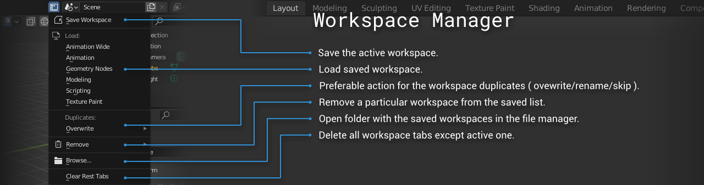

# Workspace Manager

**Workspace Manager** is an add-on for Blender, helps you to save and load the custom workspaces, collect them in one place, while having access to apply a particular workspace in any project file.

Blender Version: **2.93+, 3.0+**

# Installation

- [**DOWNLOAD**](https://github.com/tingjoybits/Workspace_Manager/releases/latest/download/Workspace_Manager.zip)<- file
- Open Blender and select Edit->Preferences
- Click Add-ons category and then 'Install...' button.
- Select the downloaded archive file from the link.
- Check the 'Workspace Manager' option.

